# Etkinlik Planlama Uygulaması 📅

Sabancı Gençlik Seferberliği / Uludağ Üniversitesi / AKSigorta İleri Düzey Java Programlama Eğitimi Bitirme Projesi.

## 1. Proje Açıklaması ve Amacı 🎯

Bu proje, kullanıcıların etkinlik oluşturabildiği, etkinlik yayınlayabildiği, diğer kullanıcıların etkinliklerini görüntüleyip katılım sağlayabildiği ve kendi etkinliklerini detaylı bir şekilde yönetebildiği kapsamlı bir web uygulamasıdır. 

Amacımız, kullanıcı dostu bir arayüz ile etkinlik yönetimini merkezileştirmek, insanların ilgi alanlarına uygun etkinlikleri keşfetmesini ve yeni organizasyonlar oluşturmasını kolaylaştırmaktır.

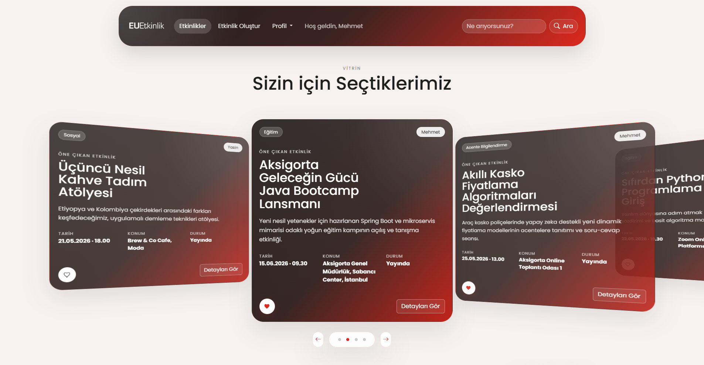

## 2. Özellikler ✨

### 👤 Kullanıcı İşlemleri
* **Kayıt ve Giriş:** Kullanıcılar Ad Soyad, Email ve Şifre (minimum uzunluk kuralları ile) ile sisteme güvenli şekilde kayıt olup giriş yapabilirler.

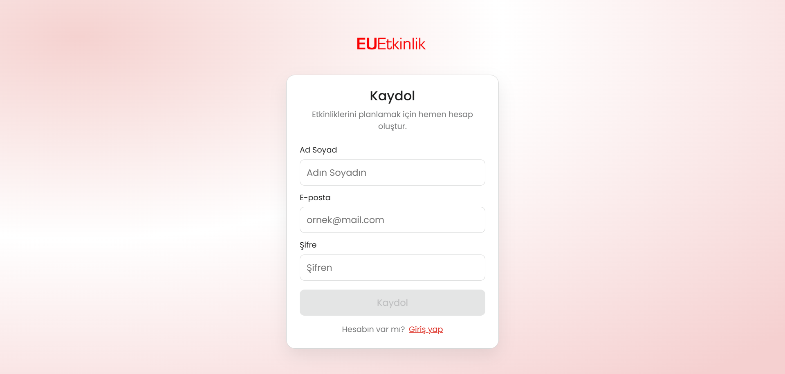
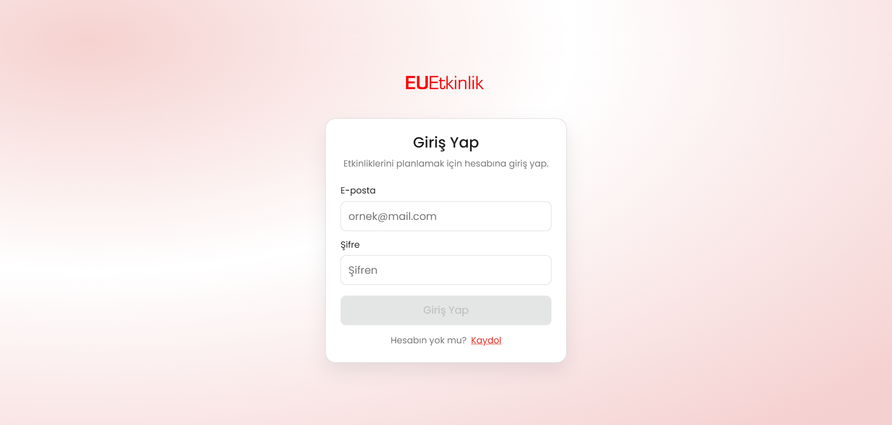

* **Oturum Yönetimi:** Kullanıcı giriş işlemleri `Http Session` ile korunmakta olup, güvenli çıkış yapma özelliği bulunmaktadır.

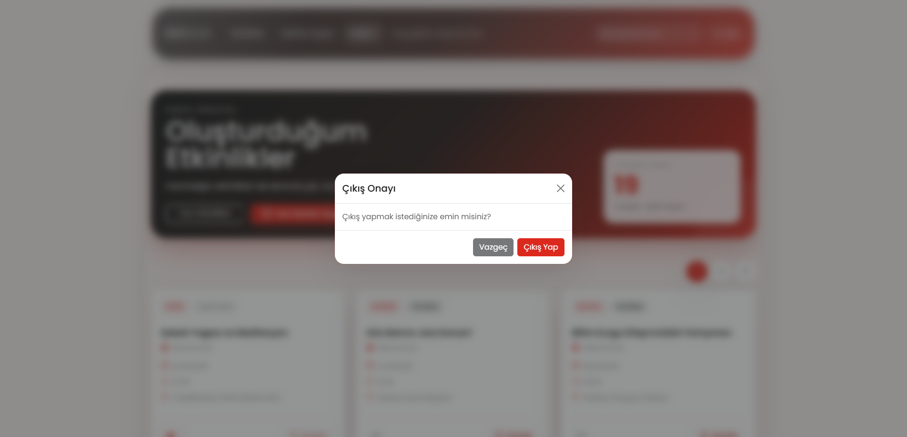

### 📅 Etkinlik İşlemleri
Kullanıcılar yeni bir etkinlik planlayabilir ve gerekli detaylarla birlikte sisteme ekleyebilirler.

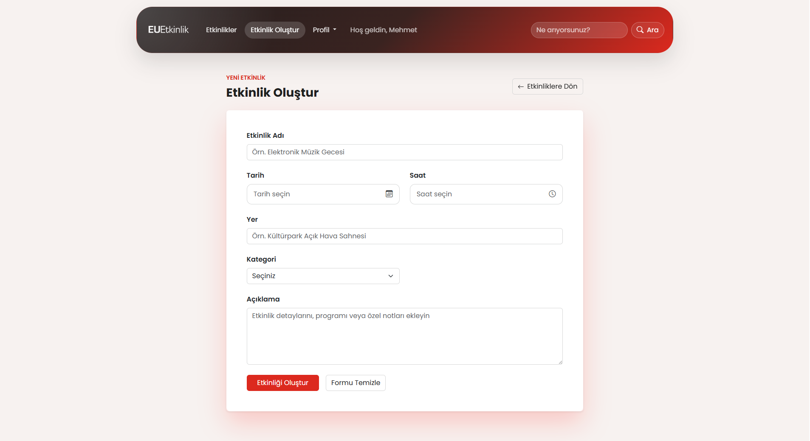

* **Etkinlik Listeleme & Keşfetme:** Sistemdeki tüm (yayındaki) etkinlikler sayfalama (pagination) kullanılarak listelenir.

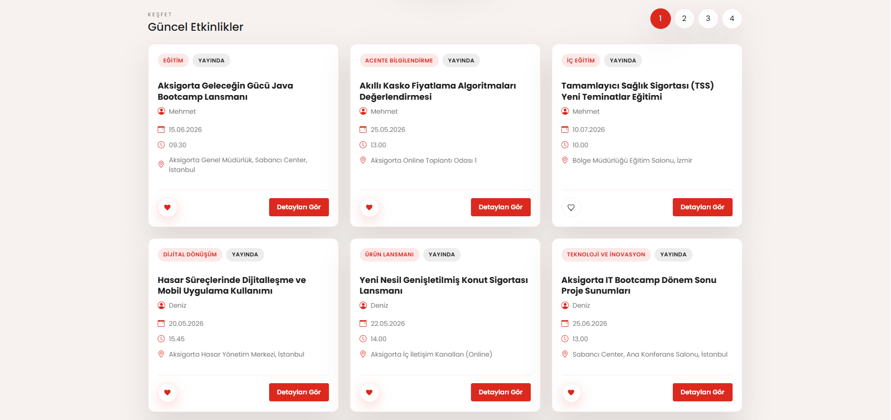

* **Etkinlik Arama:** Kullanıcılar ilgilendikleri etkinlik türlerine veya isimlerine göre arama yapabilir.

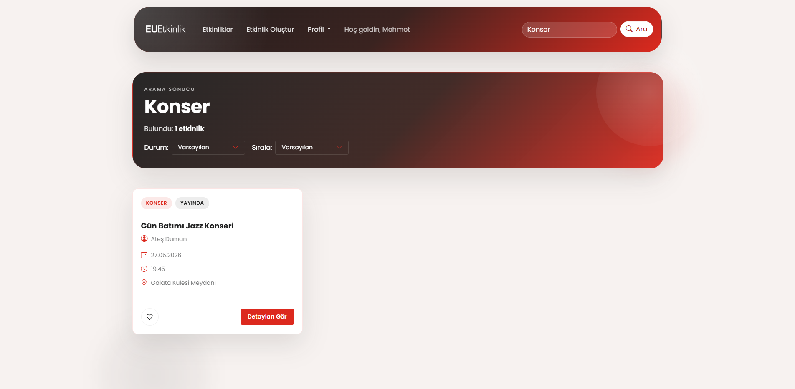

* **Etkinlik Detayları:** Etkinliklerin içeriği, yeri, zamanı ve katılımcı durumları incelenebilir.

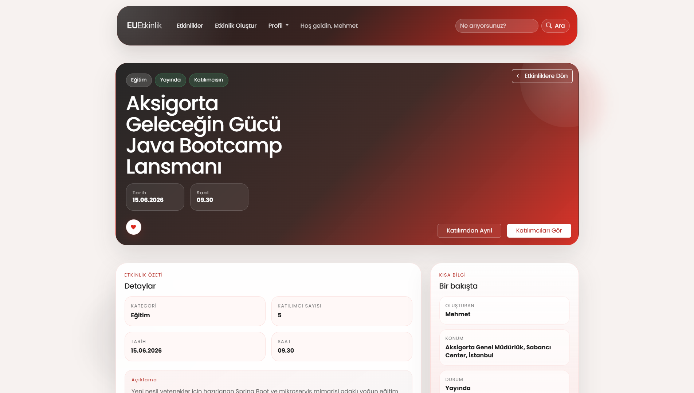

* **Favoriler:** Kullanıcılar beğendikleri etkinlikleri favorilerine ekleyebilir.

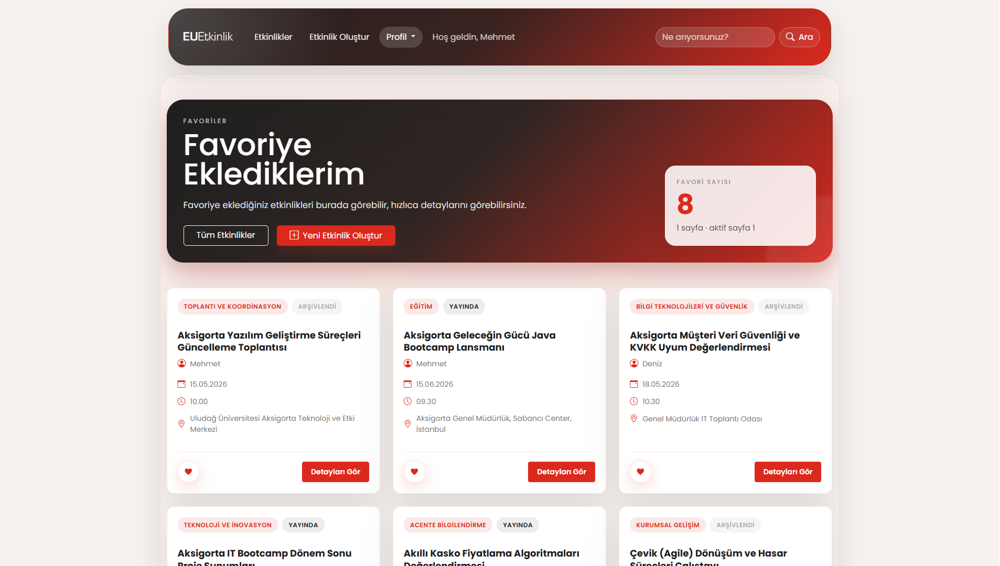

* **Etkinlik Sahibi Yetkileri:** Bir etkinliği oluşturan kullanıcı etkinliği düzenleyebilir, silebilir, yayınlayabilir, yayını durdurabilir veya süresi geçenleri arşivleyebilir.
* **Etkinlik Durumları:** `Yayında`, `Yayın Durduruldu` ve `Arşivlendi` statüleri ile aktif yönetim sağlanır.

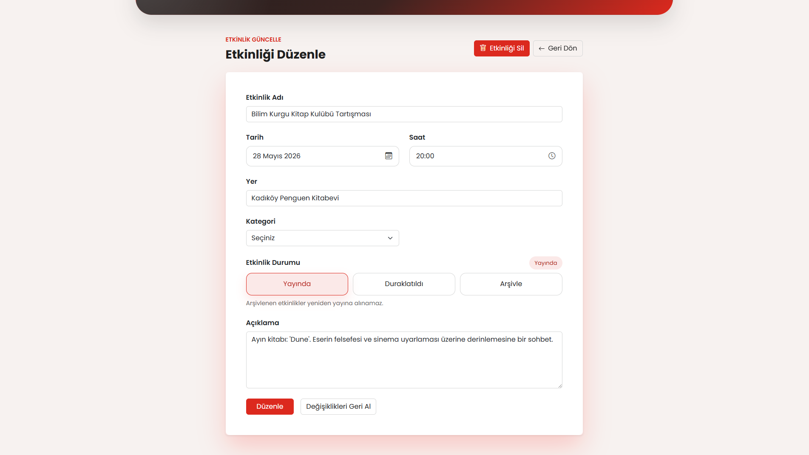

### 👥 Katılım ve Takip
* **Etkinliğe Katılma:** Giriş yapan her kullanıcı mevcut etkinliklere katılım sağlayabilir.
* **Katıldıklarım:** Kullanıcılar geçmişte katıldıkları veya katılacakları etkinlikleri sistem üzerinden takip edebilir.

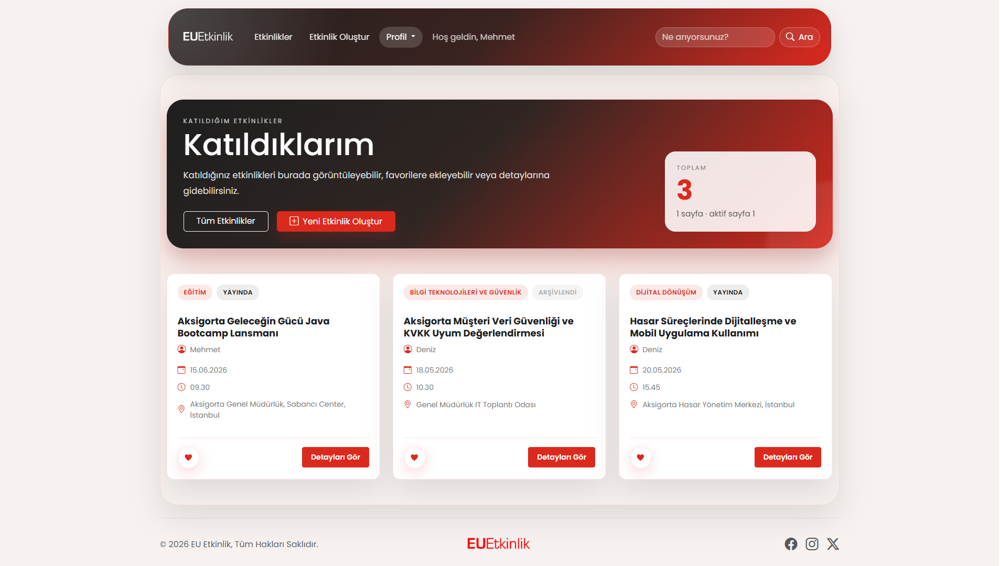

* **Katılımcı Listesi:** Etkinlik sahibi, kendi organizasyonuna kimlerin katıldığını listeleyebilir.

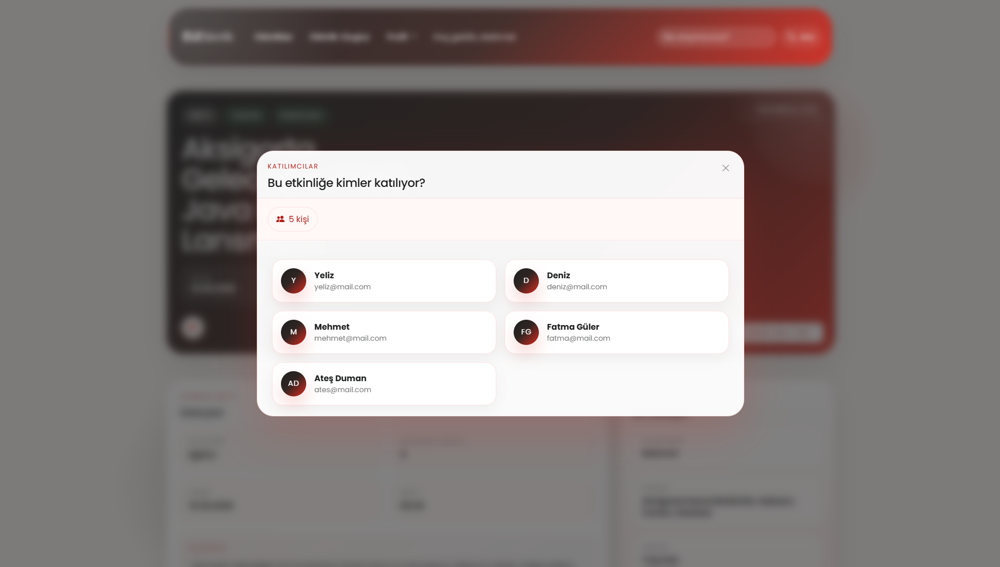

---

### 🛠️ Kullanılan Teknolojiler

**Backend:**
* Java
* Spring Boot 4.0.4
* Spring Data JPA
* H2 Database (In-Memory DB)
* Validation, DTO Yapısı
* Swagger
* Global Exception Handling
* Http Session Authentication

**Frontend:**
* Angular 21.2.0
* Bootstrap (Responsive ve kullanıcı dostu arayüz için)

## 3. Mimari Yaklaşım 📐

Projemiz **REST API** mimarisine uygun ve profesyonel endüstri standartlarını barındıran **Katmanlı Mimari** tasarımı ile geliştirilmiştir. Proje sürdürülebilirliğini artırmak için **Clean Code** standartları benimsenmiştir.

* **Controller:** İstemciden gelen istekleri (HTTP Requests) karşılar, uygun servislere iletir.
* **Service:** İş mantığının (Business Logic) yürütüldüğü katmandır.
* **Repository:** Veritabanı işlemlerinin (Spring Data JPA ile) soyutlanarak yönetildiği katmandır.
* **DTO (Data Transfer Object):** İstemci ve sunucu arasında sadece gerekli verilerin taşınması ve güvenlik için kullanılır.
* **Entity:** Veritabanı tablolarının nesnel yansımalarıdır.
* **Global Exception Handling:** Proje genelindeki muhtelif hatalar (Validation Hataları, Kayıt Bulunamadı, Yetkisiz İşlem, Sistem Hataları) merkezi bir Controller Advice üzerinden yakalanarak istemciye standart hata yanıtları döndürülür.

---

## 🚀 Kurulum ve Çalıştırma Adımları

Proje iki ayrı (Backend ve Frontend) uygulama olarak geliştirilmiştir. Sırasıyla şu adımları takip ederek projeyi ayağa kaldırabilirsiniz.

### Backend Kurulumu
1. Projenizin `backend/` klasörüne gidin.
2. Projeyi bir Java IDE'sinde (IntelliJ IDEA, Eclipse, VS Code vb.) açın.
3. Maven (veya Wrapper) yardımıyla bağımlılıkların indirilmesini sağlayın (`mvn clean install`).
4. `com.works.backend.BackendApplication` sınıfını çalıştırarak projeyi başlatın.
   * **Veritabanı:** Dahili **H2 Database** kullanılmaktadır, ekstra bir servis ayağa kaldırmanıza gerek yoktur.
   * **Sunucu Portu:** Backend uygulaması varsayılan olarak **localhost:8090** portunda çalışacaktır.

### Frontend Kurulumu
1. Terminalden `frontend/etkinlik-planlama-frontend/` dizinine gidin.
2. Node paketlerini kurmak için aşağıdaki komutu çalıştırın:
   ```bash
   npm install
   ```
3. Uygulamayı ayağa kaldırmak için:
   ```bash
   ng serve
   ```
   * Frontend uygulamasına varsayılan olarak **http://localhost:4200** adresini ziyaret ederek ulaşabilirsiniz.

---

## 📖 Swagger API Dokümantasyonu

Backend arayüzlerimizi (REST API endpoints) test etmek ve yapısını incelemek için Swagger dokümantasyonu entegre edilmiştir.

Backend ayağa kalktıktan sonra, aşağıdaki adrese giderek API'leri kolayca test edebilirsiniz:  
👉 **[http://localhost:8090/swagger](http://localhost:8090/swagger "Swagger Adresi")**

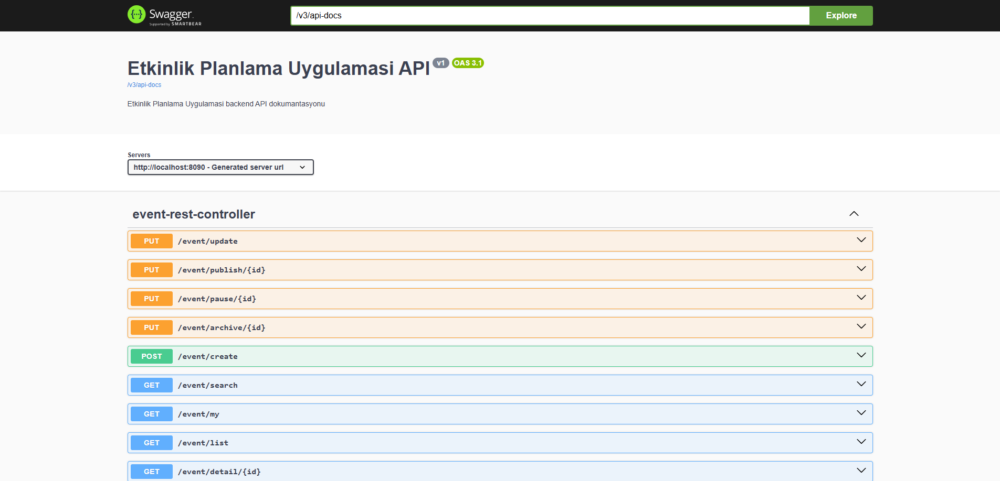 
